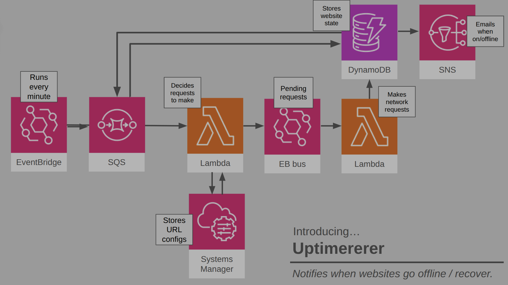

# uptimererer

An AWS service that will tell you when tracked websites go offline / recover.

## Architecture



1. **EventBridge schedule** fires every minute and drops a tick message onto an
   **SQS queue**.
2. The **dispatchererer Lambda** consumes the ticks, reads the tracked-URL
   configs from **Systems Manager Parameter Store** (`/uptimererer/urls`, a
   JSON string array), and puts one `check.requested` event per URL onto a
   custom **EventBridge bus**.
3. The **checkererer Lambda** receives each `check.requested` event, makes the
   HTTP request, and stores the result plus the site's current state in
   **DynamoDB**.
4. When a site's state flips (online ↔ offline), the checker publishes to an
   **SNS topic**, which emails subscribers.

Subscribe an email address at deploy time with
`npx cdk deploy --context environment=aws --context alertEmail=you@example.com`.

## Layout

- `lambda/checkererer` — Go Lambda that makes the network requests.
- `lambda/dispatchererer` — Go Lambda that decides which requests to make.
- `lib/uptimererer-stack.ts` — CDK stack wiring everything together.

## Development

See [README-CDK.md](README-CDK.md) for deployment (AWS or LocalStack).

```bash
make build-lambda   # build both Lambda bootstrap binaries
make test           # go vet/test + CDK assertion tests
```
